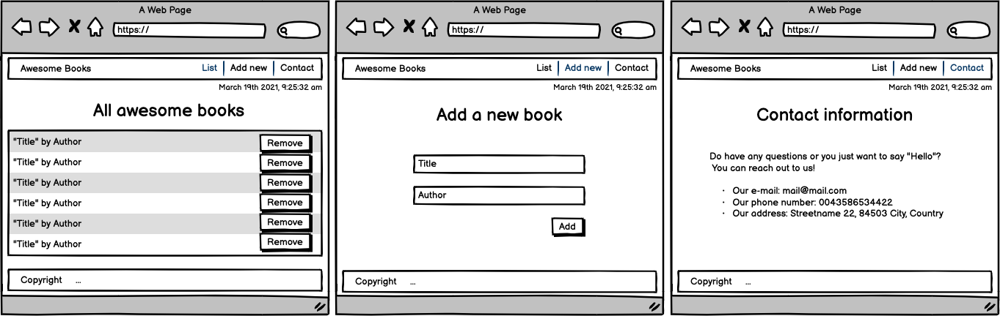

# Awesome Books

> Awesome Book-List using HTML, CSS, JavaScript

### [link Demo](https://rebel216.github.io/Awesome-Books/)

## Built With

- HTML
- CSS
- JavaScript

## Getting Started

To get a local copy up follow these simple example steps.

### Prerequisites

- Node
- Git
- Code Editor

## Authors

👤 **Author1**

- GitHub: [@rebel216](https://github.com/rebel216)
- Twitter: [@rebel216](https://twitter.com/rebel216)
- LinkedIn: [LinkedIn](https://linkedin.com/in/rebel216)

👤 **Alfred Boateng**

- GitHub: [@learnwithalfred](https://github.com/learnwithalfred)
- Twitter: [@kb_alfred](https://twitter.com/kb_alfred)
- LinkedIn: [Alfred Boateng](https://www.linkedin.com/in/alfred-boateng-704670138/)

## 🤝 Contributing

Contributions, issues, and feature requests are welcome!

Feel free to check the [issues page](../../issues/).

## Show your support

Give a ⭐️ if you like this project!

## Acknowledgments

- Project Design and inspiration from [Microverse Bootcamp](https://www.microverse.org)

## 📝 License

This project is [MIT](./MIT.md) licensed.
